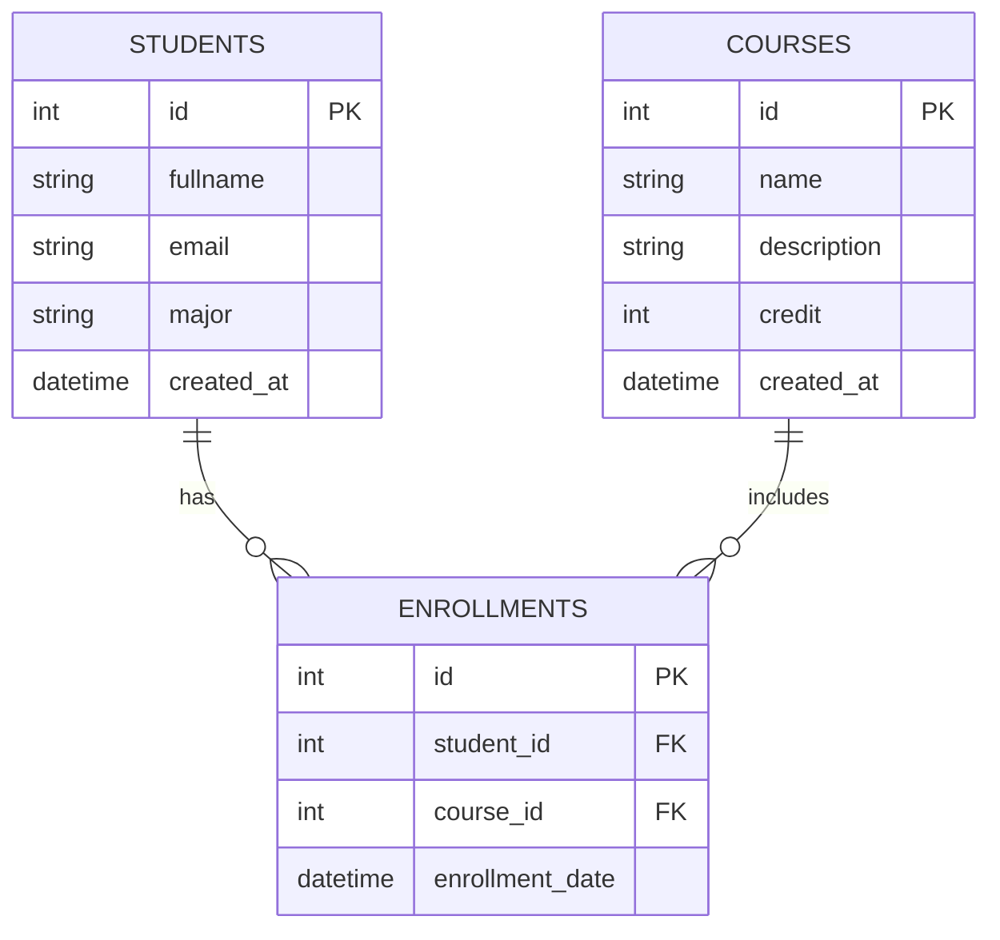

# 1. User Requirements Analysis

## Use Case Diagram
**Actors:**
- **Admin (เจ้าหน้าที่)**: Manage students, courses, enrollments.
- **Student (นักเรียน)**: View courses, view own enrollments.
- **Teacher (อาจารย์)**: View courses, view students in courses.

```mermaid
usecaseDiagram
    actor "Admin" as A
    actor "Student" as S
    actor "Teacher" as T

    package "Student Course Management System" {
        usecase "Manage Students (CRUD)" as UC1
        usecase "Manage Courses (CRUD)" as UC2
        usecase "Enroll Student" as UC3
        usecase "View Reports/Enrollments" as UC4
        usecase "Search Students" as UC5
    }

    A --> UC1
    A --> UC2
    A --> UC3
    A --> UC4
    A --> UC5

    S --> UC4
    T --> UC4
```

# 2. Database Design (Supabase)

## Entity Relationship Diagram (ERD)



## Explanations

### 1. Primary Key (PK) & Foreign Key (FK)
- **Primary Key (PK)**: Used to uniquely identify each record in a table.
    - `students.id`: Uniquely identifies a student.
    - `courses.id`: Uniquely identifies a course.
    - `enrollments.id`: Uniquely identifies an enrollment record.
- **Foreign Key (FK)**: Used to link two tables together.
    - `enrollments.student_id`: Links to `students.id` to show *who* enrolled.
    - `enrollments.course_id`: Links to `courses.id` to show *which course* was enrolled in.

### 2. Normalization
To avoid data redundancy (avoiding duplicate data), we use **3rd Normal Form (3NF)** principles:
- **1NF**: Atomic values (no lists in columns).
- **2NF**: All non-key attributes depend on the whole primary key.
- **3NF**: No transitive dependencies.
    - Instead of storing `student_name` and `course_name` repeatedly in an `Enrollment` table (which would cause redundancy if a name changes), we store only the IDs (`student_id`, `course_id`). The actual details are stored once in their respective tables (`students`, `courses`).
